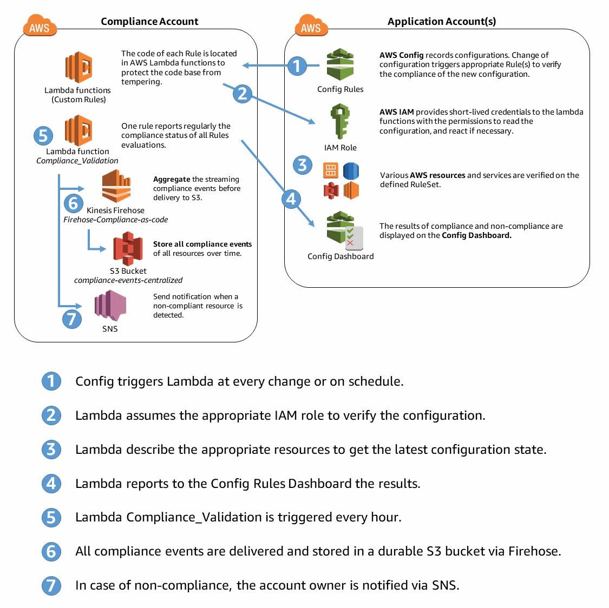

  Copyright 2017-2018 Amazon.com, Inc. or its affiliates. All Rights Reserved.
  
  Licensed under the Apache License, Version 2.0 (the "License").
  You may not use this file except in compliance with the License.
  A copy of the License is located at
  
      http://www.apache.org/licenses/LICENSE-2.0
  
  or in the "license" file accompanying this file. This file is distributed 
  on an "AS IS" BASIS, WITHOUT WARRANTIES OR CONDITIONS OF ANY KIND, either 
  express or implied. See the License for the specific language governing 
  permissions and limitations under the License.

# Objectives of the package
Deploy a compliance-as-code engine to provide insights on the compliance status of AWS accounts and resources in a multi-account environment. In addition of the engine, several sets of Rules (or RuleSets) can be deployed and are customizable depending on your environment.

## The 10 Key Features
1. Analyze current situation and trends from the compliance account as all data are pushed in a Datalake.
2. Use your favorite analytics tool (Amazon QuickSight, Tableau, Splunk, etc.) as the data is formatted to be directly consumable.
3. Classify your AWS accounts by sensitivity.
4. Adapt the RuleSet to the type of environment of the application: by specifying which RuleSet during the deployment in the application account.
5. Store all historical data of all the changes by storing the compliance record in a centralized and durable Amazon S3 bucket.
6. Deploy easily in dozens of accounts: by having a 1-step process for any new application account via AWS CloudFormation.
7. Protect the code base: by centralizing the code base of all the compliance-as-code rules in a “compliance account”.
8. Enable a cost-effective approach by limiting the number of individual AWS Config Rules, when required.
9. Make use of the AWS Config Rules Dashboard to display the details of compliance status of your AWS resources by setting up Config Aggregator. 
10. Notify on non-compliant resources by triggering an Amazon SNS topic.

## Demo
See a demo there: https://youtu.be/VR_4209ewIo?t=40m

## High Level Design
The engine for compliance-as-code design has the following key elements:
- Application account(s): AWS account(s) which has a set of requirements in terms of compliance controls. The engine verifies the compliance controls implemented in this account.
- Compliance account: the AWS account which contains the code representing the compliance requirements. It should be a restricted environment. Notification, Historical data storage and reporting are driven from this account.

## Provided RuleSets with the Engine
The set of Rules depends on the parameters you set during the deployment. Three RuleSets are available:
- Security Baseline: Includes best-practices rules ordered by criticity
- PCI Guidance: Gives guidance for achieving the Payment Card Industry Data Security Standard (PCI DSS).
- High-Availability: Focuses on the reliability of your environment

See the details of each RuleSet in the "application-account-rulesets-baseline-pci-guidance-ha-setup.yaml" file.

# User Guide

## Initial Deployment

### Requirements
1. Define an AWS Account to be the central location for the engine (Compliance Account).
2. Define the AWS Accounts to be verified by the engine (Application Accounts).

### In Compliance Account
1. Create a new bucket (ex. compliance-as-code-ruleset-112233445566) and note its name
2. Add the content of repository named "compliance-account-rulesets-setup" directly in the S3 bucket (no folder). It is composed of 2 yaml templates and several *.py and *.zip files.
3. Execute (in the same region) the CloudFormation template named: compliance-account-setup.yaml
4. Note the name of the centralized bucket you selected when launching the above CloudFormation (ex. centralized-config-112233445566)

## Add a new Application account in scope

In Application Account, execute (in the same region) the CloudFormation: application-account-rulesets-baseline-pci-guidance-ha-setup.yaml

Note 1: Depending on your selection for the parameters, the template will deploy diferent rules (see details in the template).

Note 2: You can add the Compliance Account as an Application account. The compliance Account then checks the compliance of itself.

## Add a whitelisted resource from a particular Rule

Certain resources may have a business need to not follow a particular rule. You can whitelist a resouce from being NON_COMPLIANT in the datalake, where you can query the compliance data. 

To add a resource in the whitelist:
1. Update the file compliance-account-rulesets-setup/compliance-whitelist.json (for model, there are dummy examples).
2. Ensure that the location of the whitelist is correct in the code of the lambda function named SecurityEpic7-Compliance_Validation

The resource will be then be noted as COMPLIANT, and the flag "WhitelistedComplianceType" will be set to "True" for traceability.

Note: the resource will still be shown non-compliant in the AWS console of Config Rules. 

## Visualize all the data in the Compliance Account using the Compliance-as-code Datalake

Refer to the "datalake-for-compliance-as-code" directory, to add further analytics.

# Developer Guide

## Add an SNS topic to be triggered
1. Create an SNS topic in the Compliance Account.
2. Deploy the Initial Deployment of the Compliance Account 
3. Modify "SecurityEpic7-Compliance_Validation" lambda function code to add the ARN of the SNS topic. 

## Add a new Rule to the RuleSet

### Adding a Managed Config Rules

#### Step 1: Modify in application-account-rulesets-baseline-pci-guidance-ha-setup.yaml

In the Resource section, add the Config rule as a CloudFormation resource (see existing Rules for guidance).

#### Step 2: Deploy the new Rule

In each Application Account, update the CloudFormation stack.

### Adding a Custom Config Rules to the RuleSet

#### Step 1: Modify compliance-account-rulesets-setup/compliance-account-ruleset-setup.yaml

In the Resource section, add a new stack with the proper configuration (see existing RuleSets).

#### Step 2: Modify application-account-rulesets-baseline-pci-guidance-ha-setup.yaml

In the Resource section, add the Config rule (examples provided in the sample RuleSet)

#### Step 3: Deploy the new Rule

##### Step 3.1: In Compliance Account

1. Upload in the S3 bucket you initialy created (Initial deployment - 1.), the following:
- compliance-account-ruleset-setup.yaml
- new-rule.zip

Note: the name of the code file must be the same as the zipped file, except the extension. The name defined in the yaml templates modified in Step 1 and Step 2 must be as well the same

2. Update the CloudFormation stack:
- compliance-account-setup.yaml

##### Step 3.2: In each Application Account

Update the CloudFormation stack:
- application-account-rulesets-baseline-pci-guidance-ha-setup.yaml

