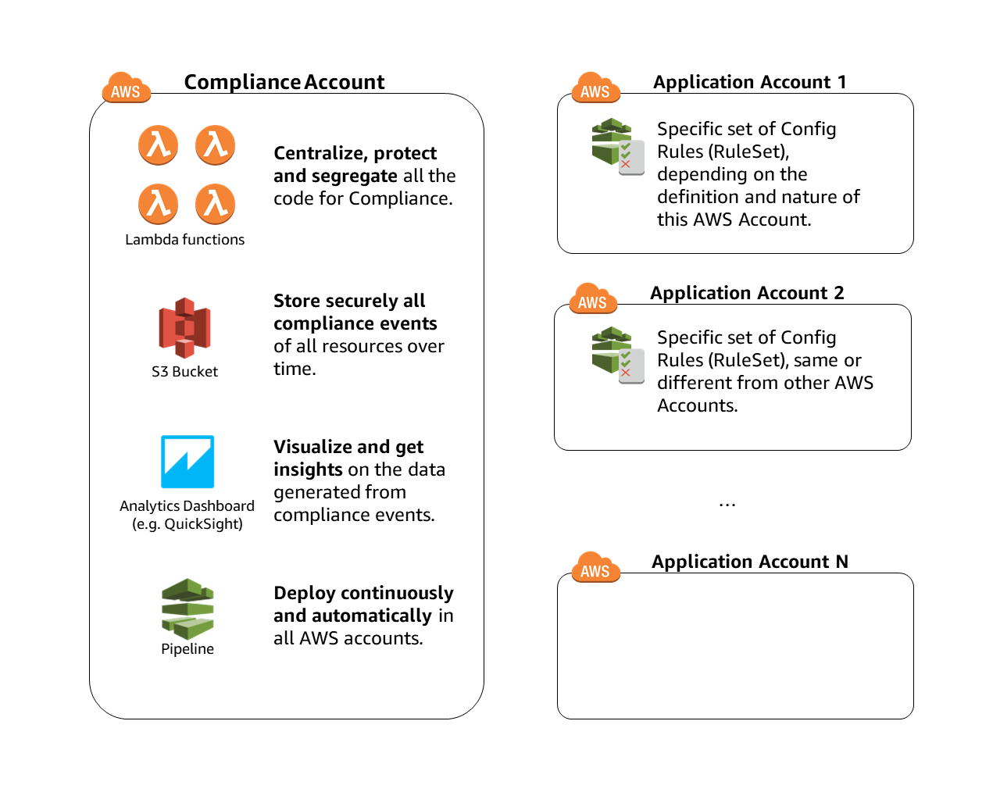
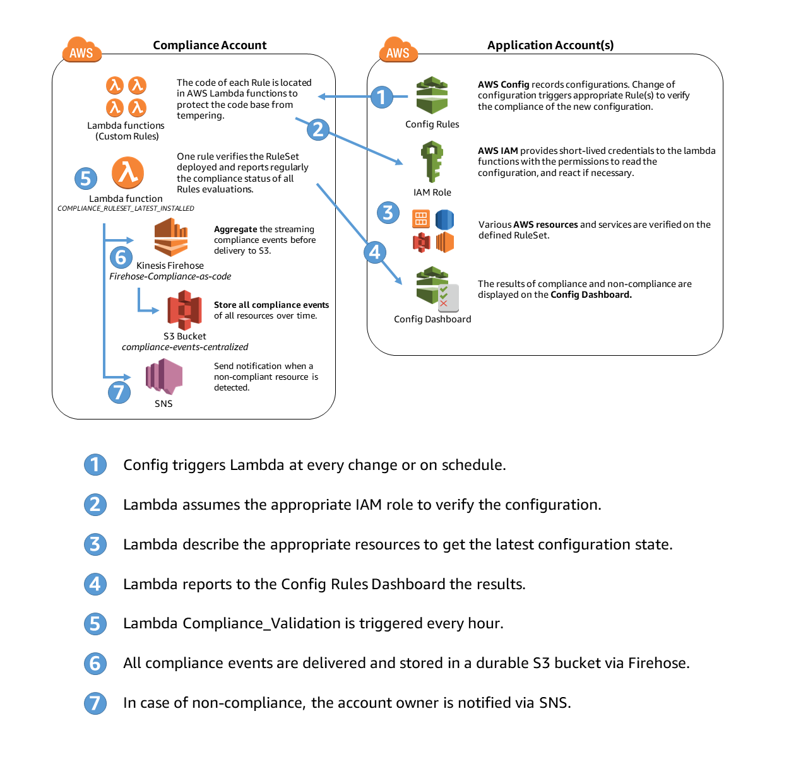

# NOTICE
**This project is not maintained any more: please reachout to rdk-maintainers@amazon.com for any questions.**

# Engine for Compliance-as-code version 2

This package is a collaborative project to deploy and operate Config Rules at scale in an multi-account environment.

## Objectives of the package

1. Deploy automatically and operate configurable sets of AWS Config Rules in a multi-account environment.
2. Provide insights and records on the compliance status of all AWS Accounts and resources.
3. Provide an initial set of recommended AWS Config Rules.

## Key Features Version 1

1. Analyze current situation and trends from the compliance account as all data are pushed in a Datalake.
2. Use your favorite analytics tool (Amazon QuickSight, Tableau, Splunk, etc.) as the data is formatted to be directly consumable.
3. Classify your AWS accounts to deploy only relevant Config Rules depending of your classification (e.g. application type, resilience, stage, sensitvity, etc.).
4. Ensure that the deployed Rules in each Account are always up-to-date.
5. Store all historical data of all the changes by storing the compliance record in a centralized and durable Amazon S3 bucket.
6. Deploy easily in 100s of accounts: by having a 1-step process for any new application account via AWS CloudFormation.
7. Protect the code base: by centralizing the code base of all the compliance-as-code rules in a dedicated "Compliance Account".
8. Make use of the AWS Config Rules Dashboard to display the details of compliance status of your AWS resources by setting up Config Aggregator.

## Key Features Version 2

1. Create Config Rules git repository and build the rules separately from aws config engine
2. Decouple IAM resources from the original Cloudformation template. IAM resources deployment required higher permissions
3. Add compliance-package-codebuild for github enterprise and codebuild integration and package rules and operational scripts as a single zip file
4. Create aggregator for config aggregated view in compliance account
5. Create and specified RDK lambda functions IAM role
6. Encrypted S3 buckets with created KMS key
7. Refactored and parameterized IAM resources names. And created env_var.properties for project specific variable.
8. Create application account config service role and specify RDK lambda functions to assume role in application account
9. Embedded account_list.json in rulesets-build/ for CI/CD. Parameter AccountList changed to AccountListLocalPath
10. Support new RDK remediation feature
11. Add script to automatically execute athena named queries
12. Implement RDK Lib lambda layer to all custom rules.
13. Add support for creating RDK lambda functions within VPC
14. Add support for config rule tagging

---

## Getting Started

### In a single AWS Region (in a single or multi-account environment)

You can follow the steps below to install the Compliance Engine.

### Deployment Steps

#### Requirements

1. Define an AWS Account to be the central location for the engine (Compliance Account).
2. Define the AWS Accounts to be verified by the engine (Application Accounts). Note: the Compliance Account can be verified to.

#### Quick Start for deploying Compliance account, and two Application account(one of it is actually the same account as Compliance account) in a Single Region
1. redefine the parameters in the 3 Config files
    - env_var.propertie
    - rulesets-build/config/account_list.json
    - rulesets-build/config/rules_lambda_vpc.json

2. redefine the parameters in quick-start.sh
    - add DeployAWSConfig=true when deploy application account if AWS config is not initialized.
    - in quick-start.sh,
        for compliance account, AWS config is initialized
        for application account, AWS config is NOT initialized

3. execute
    ```bash
        sh quick-start.sh
    ```

#### Verify the deployment works

1. Verify in the Compliance Account that the CodePipeline pipeline named "Compliance-Engine-Pipeline" is executed succesfully
2. Verify in the Compliance/Application Account that the Config Rules are deployed.


#### Compliance Account setup without quick-start.sh

1. update parameters in env_var.properties

2. (IAM admin) create iam resources for codePipeline, rdklambda, ETL Lambda

    ```bash
    aws cloudformation deploy \
        --stack-name compliance-iam \
        --template-file compliance-account-iam.yaml \
        --parameter-overrides $(cat env_var.properties) \
        --no-fail-on-empty-changeset \
        --capabilities CAPABILITY_NAMED_IAM \
        --region <mainRegion>
    ```

3. create kms key

    ```bash
    aws cloudformation deploy \
        --stack-name compliance-kms \
        --template-file compliance-account-kms-setup.yaml \
        --parameter-overrides $(cat env_var.properties) \
        --no-fail-on-empty-changeset \
        --region <mainRegion>
    ```

4. create compliance engine CI/CD pipeline, S3 buckets, Config Aggregator, Firehose, log ETL lambda

    ```bash
    aws cloudformation deploy \
        --stack-name compliance \
        --template-file compliance-account-initial-setup.yaml \
        --parameter-overrides $(cat env_var.properties) \
        --no-fail-on-empty-changeset \
        --region <mainRegion>
    ```

 5. Grant permissions for automation iam roles

    ```bash
    aws cloudformation deploy \
        --stack-name compliance-kms \
        --template-file compliance-account-kms-setup.yaml \
        --parameter-overrides $(cat env_var.properties) \
            GrantComplianceEngineAccess=true \
        --no-fail-on-empty-changeset \
        --region <mainRegion>
    ```

#### Add New Application Account

1. Add accountID in env_var.properties for new account
2. Fill out [account_list.json](ruleset-build/account_list.json) and run steps 3 and 4 in the associated accounts.
    - Make sure config recorder and config service role is created. Otherwise, add DeployAWSConfig=true in env_var.properties
3. (IAM admin in appicaltion account) Create iam resources for compliance to assume and access application account

    ```bash
    aws cloudformation deploy \
        --stack-name application-iam \
        --template-file application-account-iam.yaml \
        --parameter-overrides $(cat env_var.properties) \
        --no-fail-on-empty-changeset \
        --capabilities CAPABILITY_NAMED_IAM \
        --region <mainRegion>
    ```

4. (**Appicaltion account - targetRegion) Create compliance engine config rule to check and trigger deployment

    ```bash
    aws cloudformation deploy \
        --stack-name application \
        --template-file application-account-initial-setup.yaml \
        --parameter-overrides $(cat env_var.properties) \
        --no-fail-on-empty-changeset \
        --region <targetRegion>
    ```

5. (**Compliance account - mainRegion) Update Config Aggregator for new account

    ```bash
    aws cloudformation deploy \
        --stack-name compliance \
        --template-file compliance-account-initial-setup.yaml \
        --parameter-overrides $(cat env_var.properties) \
        --no-fail-on-empty-changeset \
        --region <mainRegion>
    ```

6. Fill out [account_list.json](ruleset-build/account_list.json) with new account configurations
    - Make sure config recorder and config service role is created. Otherwise, add DeployAWSConfig=true in env_var.properties

7. Zip the 2 directories "rules/" and "rulesets-built/" into "ruleset.zip", including the directories themselves.
8. Copy the "ruleset.zip" in the source bucket (i.e. by default "compliance-engine-codebuild-source-account_id-region_name")
9. Go to CodePipeline, then locate the pipeline named "Compliance-Engine-Pipeline". Wait that it auto-triggers (it might show "Failed" when you check for the first time).


### In multiple AWS Region (in a single or multi-account environment)

1. Follow the "Getting Started" in a single AWS Region (above)
2. Follow the "Add a new Region" in the User Guide (below)

---

## FAQ

**What are the benefits to use of this Compliance engine?**

This project assist you to manage, deploy and operate Config Rules in large AWS environment. It completely automate those tasks via a preconfigured pipeline. Additionally, it provides recommended Config Rules to be deployed as Security Baseline, mapped to the CIS Benchmark and PCI (named RuleSets).

**What is a RuleSet?**

A RuleSet is a collection of Rules. For any AWS accounts, you can decide which RuleSet you want to deploy. For example, you might have a RuleSet for highly confidential accounts, or for high-available accounts or for particular standards (e.g. CIS, PCI or NIST).

**Can I add new Rules or new RuleSets?**

Yes, we describe in the User Guide how to add new rules and new rulesets.

### What are the limits to expect from the Engine?
We expect the engine to work for 100s of accounts, we are yet to hit the limit. The limit for the number of rules per account is about 65 rules, due to CloudFormation template size limits.

### Does the engine support multi-region?
Yes, the engine is able to deploy different sets of rules between regions and accounts. By default, it deploys 2 different baselines of rules (avoid to deploy multiple rules with global scope only once, i.e. rules on AWS IAM).

### Does the engine use AWS Organizations?
No, for simplicity of the deployment and due to the multiple dimensions of each account we decided not to use AWS Organizations.

**I am already using AWS Config today. Can I still use the Engine?**

Yes, the engine is compatible with an existing setup.

---

## Overall Design

### High Level Design

The engine for compliance-as-code design has the following key elements:

- **_Application account(s)_**: AWS account(s) which has a set of requirements in terms of compliance controls. The engine verifies the compliance controls implemented in this account.
- **_Compliance account_**: the AWS account which contains the code representing the compliance requirements. It should be a restricted environment. Notification, Historical data storage and reporting are driven from this account.



### Low Level Design



### RuleSets

The set of Rules deployed in each Aplication Account depends on:

1. Initial deployment of [compliance-account-initial-setup.yaml](rulesets-build/compliance-account-analytics-setup.yaml): the parameter "`DefaultRuleSet`" in the CloudFormation template represents the default RuleSet to be deployed in any Application Accounts (main Region), not registered in account_list.json. For other regions (not the main Region), the parameter "`DefaultRuleSetOtherRegions`" in the CloudFormation template represents the default RuleSet to be deployed.
3. `rules/RULE_NAME/parameters.json`: the `parameters.json` files are included in each rule folder. Those rule metadata are matched with account metadata to deploy the proper Ruleset in each account. The rule folders can be found in the [config-rules repository](https://git-codecommit.us-east-1.amazonaws.com/v1/repos/config-rules).

## Config files

1. [env_var.properties](./env_var.properties): This file is used for overriding variables used by the individual CloudFormation templates. The individual CloudFormation templates MUST NOT define parameters.
    - MainRegion: main region that you will use for compliance account
    - OtherActiveRegions: comma delimited list for a union set of regions that rules will be deploy to
    - DefaultRuleSetOtherRegions: name of the default ruleset that will deployed in all the regions
    - CentralizedS3BucketConfigFullName: name of a S3 bucket that will be created for centralized config log bucket
    - ComplianceAccountId: Account Id for compliance account
    - RuleSetArtifactS3FileName: RuleSet artifact (compress rules/ and ruleset-build/) name that user will build and upload to S3
    - ApplicationAccountIds: comma delimited list of Account Id for all application accounts
    - KMSAdminRoleName: Name of Role that will be grant as admin to the Compliance KMS key that will be created
    - AccountListLocalPath: account list configuration file path inside rulesets-build/ (example: config/account_list.json)
    - RulesLambdaVpcConfigLocalPath: rules lambda vpc configuration file path inside rulesets-build/ (example: config/rules_lambda_vpc.json)
    - RdklibLayerName: Lambda layer name for rdklib
    - User can add parameter to override cloudformation parameters for multiple cloudformation templates
2. [account_list.json](see example: rulesets-build/config/account_list.json): This file is used to maintain metadata of each account and the rulesets they will be using.
3. [rules_lambda_vpc.json](see example: rulesets-build/config/rules_lambda_vpc.json): This file is used to provide the vpc detail if you want to create lambda functions within VPC.
    - if the values for a region is empty, lambda functions will be created without vpc

### Deployment Flow

1. When a new Application Account is added via the [application-account-initial-setup.yaml](application-account-initial-setup.yaml), one rule is installed (by default named `COMPLIANCE_RULESET_LATEST_INSTALLED`)
2. This rule verifies if the correct Config rules are installed.
3. If not, the rule create an empty *account_id*.json file to register, and it triggers the CodePipeline in the Compliance Account.
4. The pipeline looks at all accounts installed (all json file) and matches with their metadata stored in *account_list.json*.
5. If the account has no metadata (ie. not registered), the pipeline create a default template with the default ruleset (by default: baseline).
6. The pipeline then deploy the account-specific AWS Config Rules via CloudFormation in all AWS accounts (registered or not in [account_list.json](rulesets-build/account_list.json)).
7. The `COMPLIANCE_RULESET_LATEST_INSTALLED` rule is trigger every 24h (configurable) to verify that the installed ruleset is still current.

---

## User Guide

### Add a new Application Account in scope in 1 step

In Application Account, deploy (in the same region) the CloudFormation template [application-account-initial-setup.yaml](application-account-initial-setup.yaml).

The Cloudformation template does the following:

- Enable and Centralize Config
- Deploy an IAM role to allow the Compliance Engine to interact
- Deploy a Config Rule that verifies that the all the proper Rules are deployed. If the rule is non-compliant, it will trigger the deployment of an update.

After few minutes, all the Config Rules defined as "baseline" (configurable) will be deployed in this new Application Account.

### Add a whitelisted/exception resource from a particular Rule

Certain resources may have a business need to not follow a particular rule. You can whitelist a resouce from being `NON_COMPLIANT` in the datalake, where you can query the compliance data. The resource will be then be noted as `COMPLIANT`, and the flag "`WhitelistedComplianceType`" will be set to "`True`" for traceability.

To add a resource in the whitelist:

1. Update the file [compliance-whitelist.json](rulesets-build/compliance-whitelist.json) (for model, there are dummy examples).
2. Ensure that the location of the whitelist is correct in the file [etl_evaluations.py](rulesets-build/etl_evaluations.py)
3. Ensure the `WhitelistLocation` parameter in [compliance-account-initial-setup.yaml](compliance-account-initial-setup.yaml) is correct

*Note: the resource will still be shown non-compliant in the AWS console of Config Rules.*

*Note 2: certain Rules might have a whitelist/exception in the `parameters.json`, but only for custom Config rules.*

### Add a New Region
New region must be setup in compliance account before setting up in application account

1. Add OtherActiveRegions with comma delimited list of regions in [env_var.properties](./env_var.properties)
2. [**Compliance Account - mainRegion**] Run the following to update CodePipeline for new region

    ```bash
    aws cloudformation deploy \
        --stack-name compliance \
        --template-file compliance-account-initial-setup.yaml \
        --parameter-overrides $(cat env_var.properties) \
        --no-fail-on-empty-changeset \
        --region <mainRegion>
    ```

3. [**Compliance Account - newRegion**] Create KMS key for the region and grant permission to iam roles for automation in main region

    ```bash
    aws cloudformation deploy \
        --stack-name compliance-kms \
        --template-file compliance-account-kms-setup.yaml \
        --parameter-overrides $(cat env_var.properties) \
            GrantComplianceEngineAccess=true \
        --no-fail-on-empty-changeset \
        --region <newRegion>
    ```

4. [**Compliance Account - newRegion**] Create Compliance engine S3 buckets in other region

    ```bash
    aws cloudformation deploy \
        --stack-name compliance \
        --template-file compliance-account-initial-setup.yaml \
        --parameter-overrides $(cat env_var.properties) \
        --no-fail-on-empty-changeset \
        --region <newRegion>
    ```

5. [**Application Account - newRegion**] follow instruction in Section - Add New Application Account for setting up new region in new account.

### Deploy Rules differently depending of AWS Accounts

#### Add an Account list
1. Create an [account_list.json](see example: rulesets-build/config/account_list.json) following the proper format below.
2. Update AccountListLocalPath in [env_var.properties](./env_var.properties) with the account list location.

##### Single-Region Scenario

This is an advanced scenario, where you want to deploy more than the default baseline. In this scenario, you can chose precisely which rule get deployed in which account(s) in the main Region.

```JSON
{
 "AllAccounts": [{
  "Accountname": "Test Account 1",
  "AccountID": "123456789012",
  "OwnerEmail": ["admin1@domain.com"],
  "RootEmail" : "root1@domain.com",
        "Tags": ["baseline", "confidentiality:high"]
 }]
}
```

##### Multi-Region Scenario

This is an advanced scenario, where you want to deploy more than 2 different regional baselines. In this scenario, you can chose precisely which rule get deployed in which account(s) and in which region(s). **Notice the "`Region`" key.**

```JSON
{
 "AllAccounts": [{
  "Accountname": "Test Account 1",
  "AccountID": "123456789012",
  "OwnerEmail": ["admin1@domain.com"],
  "RootEmail" : "root1@domain.com",
        "Region": "us-west-1",
        "Tags": ["baseline", "confidentiality:high"]
 }, {
  "Accountname": "Test Account 1",
  "AccountID": "123456789012",
  "OwnerEmail": ["admin1@domain.com"],
  "RootEmail" : "root1@domain.com",
        "Region": "ap-southeast-1",
        "Tags": ["otherregionsbaseline", "confidentiality:high"]
 }]
}
```

#### Create the link between Account and Rules

The engine matches the Tags in the [account_list.json](rulesets-build/conifg/account_list.json) file with the Tags in the `parameters.json` found in the Rules. When a match is detected, the Rule is deployed in the target account.

### Add a new Config Rule in a RuleSet

#### Custom Rules

1. Create the rule with the [RDK tool](https://github.com/awslabs/aws-config-rdk).
2. Copy the entire RDK rule *folder* to the `./rules/` directory in the [config-rules repository](https://git-codecommit.us-east-1.amazonaws.com/v1/repos/config-rules) (including the 2 python files (code and test) and the parameters.json)
3. Use the RDK feature for "RuleSets" to add the rules to the appropriate RuleSet.
4. Add it into the "`ruleset.zip`" (see initial deployment section for details)
5. Run the CodePipeline pipeline named "`Compliance-Engine-Pipeline`"

_Note_: By default no RuleSet are configured. If you don't use the [account_list.json](rulesets-build/account_list.json) you'll need to tag the rule with the value of the parameter "`DefaultRuleSet`" (the one in the CloudFormation template) to deploy in the main region or tag the rule with the value of the parameter "`DefaultRuleSetOtherRegions`" to deploy in the other region(s).

#### Managed Rules

1. Follow the RDK instructions to add a Managed Rules in particular RuleSets.
2. Add it into the "ruleset.zip" (see initial deployment section for details)
3. Run the CodePipeline pipeline named "Compliance-Engine-Pipeline"

### Visualize all the Compliance data using the Compliance-as-code Datalake

#### Set up the Compliance Account

Execute the saved Athena Queries that you can find in `Athena` > `Saved Queries`

- 1-Database For ComplianceAsCode
- 2-Table For ComplianceAsCode
- 3-Table For Config in ComplianceAsCode
- 4-Table For AccountList (if account_list.json is configured)

### Set up Amazon QuickSight

See [official documentation](https://docs.aws.amazon.com/quicksight/latest/user/create-a-data-set-athena.html) to import an Athena query in QuickSight and follow the following recommendations:

- Make sure you add the Athena Results bucket and the original bucket in QuickSight settings.
- Make sure you grant kms access for arn:aws:iam::${AWS::AccountId}:role/service-role/aws-quicksight-service-role-v0
- We recommend to use SPICE for best performance.
- Remember to add a scheduler to refresh the SPICE Data Set(s) daily

### Prepare the data sets

1. Change the data type for the `enginerecordedtime`, `resultrecordedtime` and `configruleinvokedtime` from `String` to `Data: yyyy-MM-dd HH:mm:ss`
2. You need to create `Manually Calculated Fields`.

#### Useful Manually Calculated Fields Formulas

| DataType | Formula |
| :--: | :-- |
| **DataAge** | `dateDiff({enginerecordedtime},now())` |
| **Confidentiality** | `ifelse(isNull({accountid[accountlist]}),"NOT REGISTERED",toUpper(split({tag2},":",2)))` |
| **WeightedConfidentiality** | `ifelse({Confidentiality} = "HIGH",3,{Confidentiality} = "MEDIUM",2,{Confidentiality} = "LOW",1,0)` |
| **WeightedRuleCriticity** | `ifelse({rulecriticity} = "1_CRITICAL",4,{rulecriticity} = "2_HIGH",3,{rulecriticity} = "3_MEDIUM",2,{rulecriticity} = "4_LOW",1,0)` |
| **ClassCriti** | `{WeightedClassification} * {WeightedRuleCriticity}` |
| **KinesisProcessingError** | `ifelse(isNull({configrulearn}),"ERROR", "OK")` |

### Create Compliance dashboard on Amazon QuickSight

#### QuickSight Visuals

The following are visual that can be leveraged to get started.

##### Operational Metrics

- 60 day trend on Number of AWS Accounts by Classification
  - Type: Line Chart
  - Configurations: `X Axis: DataAge; Value: AccountID (Count Distinct); Color: AccountClassification;`
  - Filter: `DataAge <= 60`
- Accounts with Critical Non-Compliant Rules
  - Type: Horizontal Stack Bar Chart
  - Configurations: `Y Axis: AccountId; Value: RuleName (Count Distinct);`
  - Filter: `DataAge <= 1 & ClassCriti = [12,16] & ComplianceType = "NON_COMPLIANT"`
- 60-day trend on Non-compliant Rule by ClassCriti
  - Type: Line Chart
  - Configurations: `X Axis: DataAge; Value: AccountID (Count Distinct); Color: ClassCriti;`
  - Filter: `DataAge <= 60`
- Resources in all Accounts
  - Type: Horizontal Stack Bar Chart
  - Configurations: `Y Axis: ResourceType; Value: ResourceID (Count Distinct);`
  - Filter: `DataAge <= 1`
- Account Distribution by Account Classification
  - Type: Horizontal Stack Bar Chart
  - Configurations: `Y Axis: accountclassification; Value: AccountID (Count Distinct)`
  - Filter: `DataAge = 0`
- Rule Distribution by Rule Criticity
  - Type: Horizontal Stack Bar Chart
  - Configurations: `Y Axis: rulecriticity; Value: RuleName (Count Distinct)`
  - Filter: `DataAge <= 1`
- Non-Compliant Resources by RuleName and by ClassCriti
  - Type: Heat Map
  - Configurations: `Row: RuleName ; Columns: ClassCriti; Values ResourceID (Count Distinct)`
  - Filter: `DataAge <= 1 & ComplianceType = "NON_COMPLIANT"`
- Trend of Non-Compliant Resources by Account Classification
  - Type: Line Chart
  - Configurations: `X Axis: RecordedInDDBTimestamp; Value: ResourceID (Count Distinct); Color: accountclassification`
  - Filter: `ComplianceType = "NON_COMPLIANT"`
- List of Rules and Non-Compliant Resources
  - Type: Table
  - Configurations: `Group by: rulename, resourceid; Value: ClassCriti (Max), AccountID (Count Distinct)`
  - Filter: `DataAge <= 1`

##### Executive Metrics

- Overall Compliance of Rules by Account Classification
  - Type: Horizontal stacked 100% bar chart
  - Configurations: `Y axis: AccountClassification; Value: RuleArn (Count Distinct); Group/Color: ComplianceType`
  - Filter: `DataAge <= 1`
- Evolution of Compliance Status (last 50 days)
  - Type: Vertical stacked 100% bar chart
  - Configurations: `X axis: DataAge, Group/Color: ComplianceType`
  - Filter: `DataAge <= 50`
- Top 3 Account Non Compliant (weighted)
  - Type: Horizontal stacked bar chart
  - Configurations: `Y axis: AccountID , Value: DurationClassCriti (Sum), Group/Color: ClassCriti`
  - Filter: `ClassCriti >= 8`

---

## Team

- Ricky Chau - version 2 release
- Jonathan Rault - Idea, Design, Coding and Feedback
- Michael Borchert - Design, Coding and Feedback

---

## License

This project is licensed under the Apache 2.0 License

---

## Acknowledgments

# Team

- Ricky Chau - version 2 release
- Jonathan Rault - Idea, Design, Coding and Feedback
- Michael Borchert - Design, Coding and Feedback

---

## Related Projects

- [Rule Development Kit](https://github.com/awslabs/aws-config-rdk)
- [Rules repository](https://github.com/awslabs/aws-config-rules)
